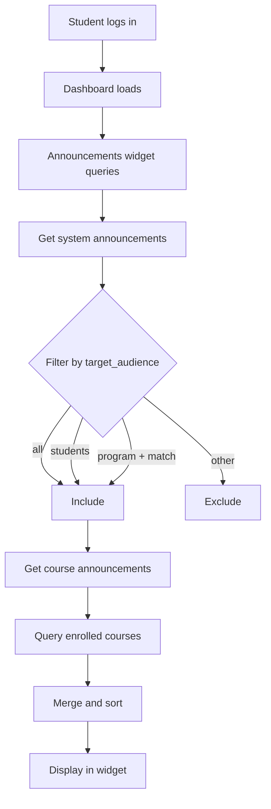
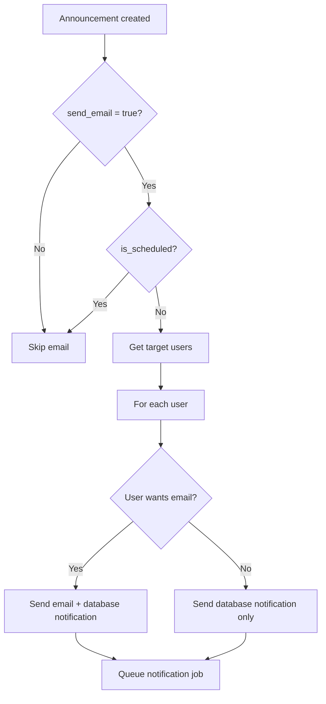

# Announcements Feature - Comprehensive Overview

## Table of Contents
1. [Feature Summary](#feature-summary)
2. [Database Architecture](#database-architecture)
3. [Backend Components](#backend-components)
4. [Frontend Components](#frontend-components)
5. [Data Flow & Workflows](#data-flow--workflows)
6. [Target Audience Filtering](#target-audience-filtering)
7. [Notification System](#notification-system)
8. [Identified Issues](#identified-issues)
9. [Enhancement Recommendations](#enhancement-recommendations)

---

## Feature Summary

The announcements feature allows administrators and instructors to create and manage announcements for different audiences within the LMS. There are two types of announcements:

1. **System Announcements** (Admin-only): Broadcast messages to all users or specific user groups
2. **Course Announcements** (Instructor): Course-specific announcements for enrolled students

### Key Features
- ✅ Modal-based create/edit forms (Admin)
- ✅ Target audience filtering (all, students, instructors, admins, specific program)
- ✅ Priority levels (low, medium, high)
- ✅ Scheduled publishing
- ✅ Expiration dates
- ✅ Email notifications (with user preference checks)
- ✅ Dashboard widget integration
- ✅ Real-time filtering by status and priority

---

## Database Architecture

### Main Table: `announcements`

**Schema** ([create_announcements_table.php](file:///c:/laragon/www/lms/database/migrations/2025_12_06_202736_create_announcements_table.php)):

| Column | Type | Description |
|--------|------|-------------|
| `id` | bigint | Primary key |
| `course_id` | bigint (nullable) | Foreign key to courses (null for system announcements) |
| `user_id` | bigint | Foreign key to users (creator) |
| `title` | string | Announcement title |
| `content` | text | Announcement content |
| `type` | enum | 'course' or 'system' |
| `priority` | enum | 'low', 'medium', or 'high' |
| `target_audience` | string | 'all', 'students', 'instructors', 'admins', or 'program' |
| `program_id` | bigint (nullable) | Foreign key to programs (for program-specific announcements) |
| `is_published` | boolean | Publication status |
| `publish_at` | timestamp (nullable) | Scheduled publish time |
| `expires_at` | timestamp (nullable) | Expiration time |
| `send_email` | boolean | Whether to send email notifications |
| `created_at` | timestamp | Creation timestamp |
| `updated_at` | timestamp | Last update timestamp |

**Indexes**:
- `course_id`
- `type`
- `publish_at`
- `created_at`
- Composite: `(type, is_published, created_at)`

**Relationships**:
- `belongsTo` Course (nullable)
- `belongsTo` User (creator)
- `belongsTo` Program (nullable)

---

## Backend Components

### 1. Model: `Announcement`
**Location**: [app/Models/Announcement.php](file:///c:/laragon/www/lms/app/Models/Announcement.php)

#### Key Methods

**Scopes**:
```php
published()      // Only published announcements
active()         // Published and not expired
forCourse($id)   // Course-specific announcements
systemWide()     // System announcements only
```

**Attributes**:
```php
is_expired       // Check if announcement is expired
is_scheduled     // Check if scheduled for future
priority_color   // Get badge color for UI
```

**Business Logic**:
```php
shouldSendEmail()    // Determine if email should be sent
getTargetUsers()     // Get users who should receive this announcement
```

### 2. Controllers

#### SystemAnnouncementController (Admin)
**Location**: [app/Http/Controllers/Admin/SystemAnnouncementController.php](file:///c:/laragon/www/lms/app/Http/Controllers/Admin/SystemAnnouncementController.php)

**Routes**:
- `GET /admin/announcements` - List all system announcements
- `POST /admin/announcements` - Create new announcement
- `GET /admin/announcements/{id}` - View announcement
- `GET /admin/announcements/{id}/edit` - Get announcement data (JSON for modal)
- `PUT /admin/announcements/{id}` - Update announcement
- `DELETE /admin/announcements/{id}` - Delete announcement

**Key Features**:
- Target audience validation
- Program-specific filtering
- Automatic notification dispatch
- Debug logging for troubleshooting

#### AnnouncementController (Instructor)
**Location**: [app/Http/Controllers/Instructor/AnnouncementController.php](file:///c:/laragon/www/lms/app/Http/Controllers/Instructor/AnnouncementController.php)

**Routes**:
- `GET /programs/{program}/courses/{course}/announcements` - List course announcements
- `POST /programs/{program}/courses/{course}/announcements` - Create announcement
- `GET /programs/{program}/courses/{course}/announcements/{id}` - View
- `PUT /programs/{program}/courses/{course}/announcements/{id}` - Update
- `DELETE /programs/{program}/courses/{course}/announcements/{id}` - Delete

**Authorization**: Verifies instructor has access to the course

#### AnnouncementViewController
**Location**: [app/Http/Controllers/AnnouncementViewController.php](file:///c:/laragon/www/lms/app/Http/Controllers/AnnouncementViewController.php)

**Routes**:
- `GET /announcements` - View all announcements for authenticated user
- `GET /announcements/{id}` - View specific announcement

**Features**:
- Combines system and course announcements
- Filters by user type and program
- Access control for course announcements

### 3. Notification Class
**Location**: [app/Notifications/AnnouncementNotification.php](file:///c:/laragon/www/lms/app/Notifications/AnnouncementNotification.php)

**Channels**: Database + Email (conditional)

**Email Conditions**:
1. Announcement has `send_email = true`
2. User wants email for that notification type (via `wantsNotificationEmail()`)

**Notification Data**:
- Announcement ID, title, content
- Type, priority, course info
- Creator name
- Action URL
- Icon based on priority

---

## Frontend Components

### 1. Admin Announcements Index
**Location**: [resources/views/pages/admin/announcements/index.blade.php](file:///c:/laragon/www/lms/resources/views/pages/admin/announcements/index.blade.php)

**Features**:
- Card-based grid layout
- Filter by status (all, published, draft, scheduled)
- Filter by priority (all, high, medium, low)
- Create modal with full form
- Edit modal with AJAX data loading
- Delete confirmation with SweetAlert2
- Hover animations

**Modals**:
- **Create Modal**: Full form for new announcements
- **Edit Modal**: Pre-populated form with existing data

**JavaScript Functionality**:
- Dynamic program selector (shows when target_audience = 'program')
- Client-side filtering
- AJAX edit data loading
- Form validation

### 2. Dashboard Widget
**Location**: [resources/views/components/dashboard/announcements-widget.blade.php](file:///c:/laragon/www/lms/resources/views/components/dashboard/announcements-widget.blade.php)

**Features**:
- Timeline-based display
- Shows recent announcements (limit: 5)
- Filters by target audience automatically
- Displays priority badges
- "New" badge for today's announcements
- Links to full announcement view

**Target Audience Filtering Logic**:
```php
where(function($query) use ($user) {
    $query->where('target_audience', 'all')
          ->orWhere('target_audience', $user->user_type . 's')
          ->orWhere(function($q) use ($user) {
              if ($user->program_id) {
                  $q->where('target_audience', 'program')
                    ->where('program_id', $user->program_id);
              }
          });
})
```

### 3. Instructor Announcements
**Location**: [resources/views/pages/instructor/announcements/](file:///c:/laragon/www/lms/resources/views/pages/instructor/announcements/)

**Files**:
- `index.blade.php` - List course announcements
- `create.blade.php` - Create form
- `edit.blade.php` - Edit form
- `show.blade.php` - View announcement

---

## Data Flow & Workflows

### Creating a System Announcement (Admin)

```mermaid
graph TD
    A[Admin clicks 'New Announcement'] --> B[Modal opens]
    B --> C[Admin fills form]
    C --> D{Target Audience?}
    D -->|Program| E[Select specific program]
    D -->|Other| F[Continue]
    E --> F
    F --> G[Submit form]
    G --> H[SystemAnnouncementController@store]
    H --> I[Validate data]
    I --> J[Create announcement record]
    J --> K{Should send email?}
    K -->|Yes| L[Get target users]
    K -->|No| M[Redirect with success]
    L --> N[Send notifications]
    N --> O[Check user preferences]
    O --> P[Send via database + email]
    P --> M
```

### Viewing Announcements (Student)



---

## Target Audience Filtering

### System Announcements

The `target_audience` field determines who sees the announcement:

| Value | Description | Filter Logic |
|-------|-------------|--------------|
| `all` | All users | No filtering |
| `students` | Students only | `user_type = 'student'` |
| `instructors` | Instructors only | `user_type = 'instructor'` |
| `admins` | Admins only | `user_type = 'admin'` |
| `program` | Specific program | `program_id = X` |

### Implementation Locations

**Dashboard Widget** ([announcements-widget.blade.php](file:///c:/laragon/www/lms/resources/views/components/dashboard/announcements-widget.blade.php#L21-L31)):
```php
->where(function($query) use ($user) {
    $query->where('target_audience', 'all')
          ->orWhere('target_audience', $user->user_type . 's')
          ->orWhere(function($q) use ($user) {
              if ($user->program_id) {
                  $q->where('target_audience', 'program')
                    ->where('program_id', $user->program_id);
              }
          });
})
```

**Notification Dispatch** ([SystemAnnouncementController.php](file:///c:/laragon/www/lms/app/Http/Controllers/Admin/SystemAnnouncementController.php#L181-L224)):
```php
switch ($targetAudience) {
    case 'students':
        $query->where('user_type', 'student');
        break;
    case 'instructors':
        $query->where('user_type', 'instructor');
        break;
    case 'admins':
        $query->where('user_type', 'admin');
        break;
    case 'program':
        if ($programId) {
            $query->where('program_id', $programId);
        }
        break;
}
```

---

## Notification System

### Email Notification Flow



### User Preference Check

The system respects user notification preferences via `User::wantsNotificationEmail()`:

**Location**: [app/Models/User.php](file:///c:/laragon/www/lms/app/Models/User.php#L119-L129)

```php
public function wantsNotificationEmail(string $type): bool
{
    $settings = $this->notificationSettings()->first();
    
    if (!$settings) {
        $settings = NotificationSetting::getOrCreateForUser($this->id);
    }
    
    return $settings->shouldSendEmail($type);
}
```

**Notification Types**:
- `course_announcements` - For course announcements
- `system_notifications` - For system announcements

---

## Identified Issues

### 🔴 Critical Issues

1. **Inconsistent Field Naming**
   - **Location**: [SystemAnnouncementController.php](file:///c:/laragon/www/lms/app/Http/Controllers/Admin/SystemAnnouncementController.php#L145)
   - **Issue**: Validation uses `expire_at` but update uses `expires_at`
   - **Impact**: Expiration date may not update correctly
   ```php
   // Line 145: Validation
   'expire_at' => 'nullable|date|after:publish_at',
   
   // Line 156: Update
   'expires_at' => $validated['expire_at'] ?? null,
   ```

2. **Missing Target Audience Validation in AnnouncementViewController**
   - **Location**: [AnnouncementViewController.php](file:///c:/laragon/www/lms/app/Http/Controllers/AnnouncementViewController.php#L19-L23)
   - **Issue**: System announcements query doesn't filter by target_audience
   - **Impact**: Users may see announcements not intended for them
   ```php
   // Current code - no target_audience filtering
   $systemAnnouncements = Announcement::systemWide()
       ->published()
       ->active()
       ->latest()
       ->paginate(10);
   ```

### ⚠️ Medium Priority Issues

3. **Instructor Notification Logic Issue**
   - **Location**: [AnnouncementController.php](file:///c:/laragon/www/lms/app/Http/Controllers/Instructor/AnnouncementController.php#L155-L157)
   - **Issue**: Gets students by `program_id`, but should get students enrolled in the specific course
   - **Impact**: May send notifications to students not enrolled in the course
   ```php
   // Current - gets all students in program
   $students = \App\Models\User::where('program_id', $course->program_id)
       ->where('user_type', 'student')
       ->get();
   
   // Should get students enrolled in THIS course
   ```

4. **Missing Validation for Scheduled Announcements**
   - **Issue**: No validation to ensure `publish_at` is in the future when creating
   - **Impact**: Announcements can be "scheduled" for past dates

5. **No Scheduled Publishing Mechanism**
   - **Issue**: Announcements with `publish_at` in the future won't automatically publish
   - **Impact**: Requires manual intervention or a scheduled job

### 💡 Minor Issues

6. **Hardcoded Route in Edit AJAX**
   - **Location**: [index.blade.php](file:///c:/laragon/www/lms/resources/views/pages/admin/announcements/index.blade.php#L420)
   - **Issue**: Uses hardcoded URL instead of `route()` helper
   ```javascript
   fetch(`/admin/announcements/${announcementId}/edit`)
   ```

7. **Missing Error Handling in AJAX**
   - **Location**: [index.blade.php](file:///c:/laragon/www/lms/resources/views/pages/admin/announcements/index.blade.php#L420-L441)
   - **Issue**: No `.catch()` for failed AJAX requests
   - **Impact**: Silent failures when edit modal fails to load

8. **Inconsistent Date Format**
   - **Location**: [index.blade.php](file:///c:/laragon/www/lms/resources/views/pages/admin/announcements/index.blade.php#L252)
   - **Issue**: Form field name is `expire_at` but should be `expires_at`

---

## Enhancement Recommendations

### High Priority

1. **Fix Field Naming Consistency**
   - Standardize on `expires_at` throughout the application
   - Update validation rules and form fields

2. **Implement Target Audience Filtering in AnnouncementViewController**
   - Add the same filtering logic as the dashboard widget
   - Ensure users only see announcements intended for them

3. **Fix Instructor Course Notification Logic**
   - Query students enrolled in the specific course, not all students in the program
   - Use course enrollments relationship

4. **Add Scheduled Publishing Job**
   - Create a scheduled command to publish announcements when `publish_at` is reached
   - Send notifications at publish time for scheduled announcements

### Medium Priority

5. **Improve Validation**
   - Add validation to ensure `publish_at` is in the future (or null)
   - Add validation to ensure `expires_at` is after `publish_at`
   - Add validation to ensure `program_id` is required when `target_audience = 'program'`

6. **Add Error Handling**
   - Add `.catch()` handlers for AJAX requests
   - Display user-friendly error messages
   - Log errors for debugging

7. **Enhance User Experience**
   - Add loading states for modal forms
   - Add success animations
   - Implement real-time updates (optional)

### Low Priority

8. **Add Rich Text Editor**
   - Implement a WYSIWYG editor for announcement content
   - Support formatting, links, images

9. **Add Announcement Analytics**
   - Track views/reads
   - Show read receipts
   - Display engagement metrics

10. **Add Announcement Categories/Tags**
    - Allow categorization for better organization
    - Enable filtering by category

---

## Routes Summary

### Public Routes (Authenticated)
```
GET  /announcements              - View all announcements
GET  /announcements/{id}         - View specific announcement
```

### Admin Routes
```
GET    /admin/announcements              - List system announcements
POST   /admin/announcements              - Create announcement
GET    /admin/announcements/{id}         - View announcement
GET    /admin/announcements/{id}/edit    - Get announcement data (JSON)
PUT    /admin/announcements/{id}         - Update announcement
DELETE /admin/announcements/{id}         - Delete announcement
```

### Instructor Routes
```
GET    /programs/{program}/courses/{course}/announcements              - List
POST   /programs/{program}/courses/{course}/announcements              - Create
GET    /programs/{program}/courses/{course}/announcements/{id}         - View
GET    /programs/{program}/courses/{course}/announcements/{id}/edit    - Edit form
PUT    /programs/{program}/courses/{course}/announcements/{id}         - Update
DELETE /programs/{program}/courses/{course}/announcements/{id}         - Delete
```

---

## Testing Checklist

### Functional Testing

- [ ] Admin can create system announcement for all users
- [ ] Admin can create announcement for specific user type
- [ ] Admin can create announcement for specific program
- [ ] Admin can schedule announcement for future
- [ ] Admin can set expiration date
- [ ] Email notifications sent to correct users
- [ ] Email respects user preferences
- [ ] Instructor can create course announcement
- [ ] Course announcements only visible to enrolled students
- [ ] Dashboard widget shows correct announcements
- [ ] Filtering by status works correctly
- [ ] Filtering by priority works correctly
- [ ] Edit modal loads existing data
- [ ] Delete confirmation works
- [ ] Scheduled announcements don't send emails immediately

### Edge Cases

- [ ] Announcement with no expiration
- [ ] Announcement scheduled for past (should fail validation)
- [ ] Program-specific announcement without program_id
- [ ] User with no notification settings
- [ ] Course announcement for course with no students
- [ ] Expired announcements don't appear in active list
- [ ] Unpublished announcements not visible to users

---

## Conclusion

The announcements feature is well-structured with good separation of concerns between system and course announcements. The modal-based UI provides a smooth user experience, and the target audience filtering allows for precise control over who sees each announcement.

However, there are several critical issues that need to be addressed:
1. Field naming inconsistencies
2. Missing target audience filtering in some views
3. Incorrect notification logic for course announcements
4. Lack of automated scheduled publishing

Addressing these issues will ensure the feature works correctly and provides a reliable communication channel within the LMS.
